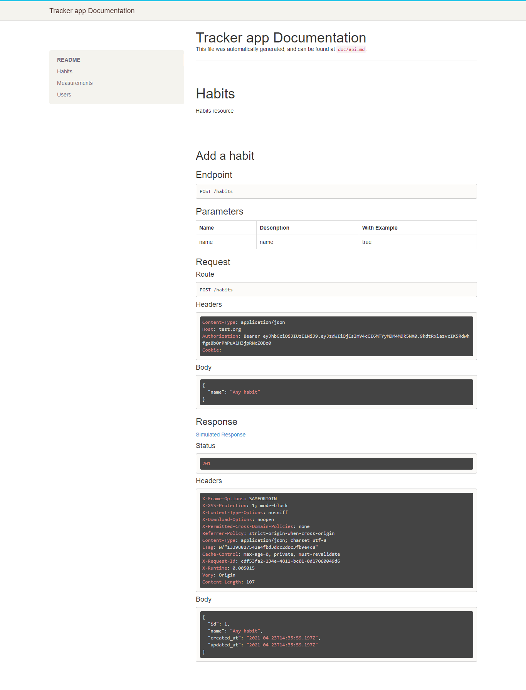

# tracker_app_backend
I had to build the backend API for a mobile-web tracking application.
- To use the app, you have to sign in or log in
- Authenticated user:
  - can make CRUD operations on habits
  - can make CRUD operations for measures related to a habit
- The route for the API documentation is /api/docs.

## Project screenshot

## 🔨 Built in

- Ruby on Rails 6.0.3
- Bootstrap 4
- rspec_api_documentation
- apitome

## 🚀 Our Project

Our project can be found at https://github.com/daviidy/tracker_app_backend

## Live Demo

You can find the demo [here](https://tracker-back-mcv.herokuapp.com/api/docs)

## To run the project in local

- clone the repository from here [repo link](https://github.com/daviidy/tracker_app_backend)
- Open terminal and navigate to root folder (/tracker_app_backend).
- Once in root folder
  - type: `rails s` in terminal and in browser
  - run `bundle install`
  - run `yarn install`
  - run`rails db:create`
  - run `rails db:migrate`
  - type localhost:3000/ in address bar.

## How to run the test suite

We added validations and associations tests for User, Event and Attendance models.
We added also integration tests for authentication and event creation
Run these tests with those commands:

### tests
- run `rspec` at the root of the project folder

### tests error 

If you have this error while running the test

`KeyError:
   key not found: :secret_key_base`

- run `rake secret`
- make sure you have a master.key file in your config folder
- add this to your env file

`RAILS_MASTER_KEY=your_master_key_content
SECRET_KEY_BASE=your_generated_secret_key`

## 👨🏽‍💻 👨🏿‍💻 Creator

👤 **David YAO**

- Github: [@daviidy](https://github.com/daviidy)

## 🤝 Contributing

Contributions, issues and feature requests are welcome!

## Show your support

Give a ⭐️ if you like this project!

## 📝 License

This project is no licensed.
